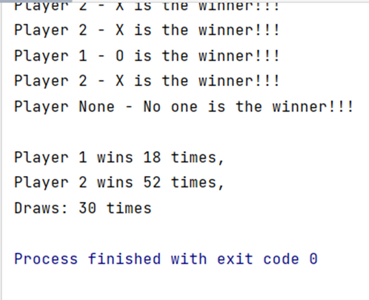

# TicTacToe_AI
TicTacToe with AI players

The game was implemented using easyAI module. Two AI players with variable depth configuration of Negamax 
or Expecti-minimax alghoritm are used.
Scores will be calculated and recorded once all games have been completed.
Elapsed time was printed after all games.

<h2>PARAMETER possible_loss == True</h2>

There is a 20% chance, that AI bot will fail. In that case, it loses its turn and 
the other one continues.

<h2>PARAMETER possible_loss == False</h2>

Classical game TicTacToe.

<h2>PARAMETER pruning == True</h2>

Alpha-beta pruning modification is used.

<h2>PARAMETER pruning == False</h2>

Classical algorithm without alpha-beta pruning.

<h2>PARAMETER mode == 'negamax'</h2>

Negamax algorithm is used to calculate the best turn for each AI players.

<h2>PARAMETER mode == 'expecti'</h2>

Expecti-minimax algorithm is used to calculate the best turn for each AI players.

The results is printed in command prompt: 

